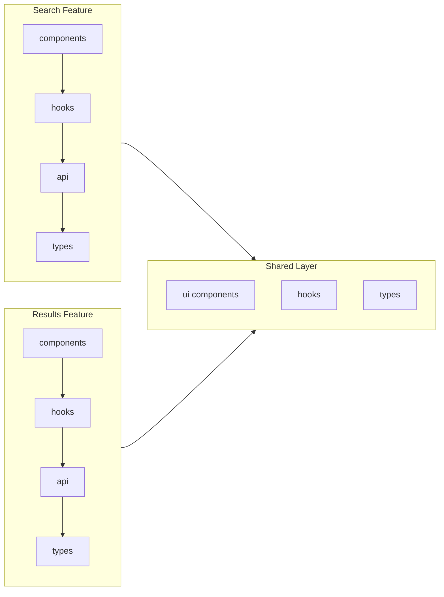
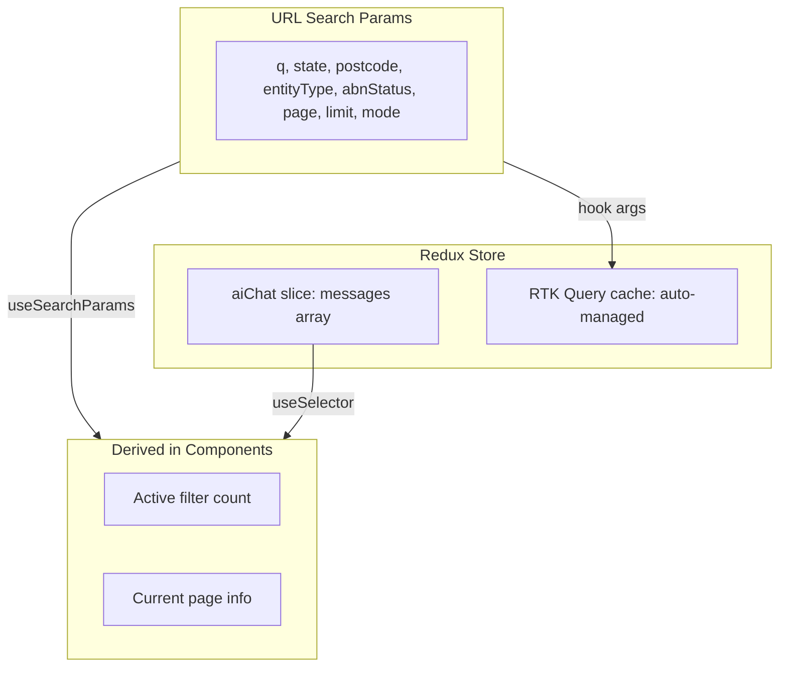

# Vantage Frontend -- Technical Strategy and Implementation Plan

---

## 1. Folder Structure (Vertical Slice Architecture)

Vertical Slice Architecture organizes code by **feature/domain** rather than by technical role. Each feature slice owns everything it needs (components, hooks, API definitions, types). Cross-cutting concerns live in `shared/`. Pages are thin composition layers.

```
vantage/frontend/
  public/
    favicon.svg
  src/
    app/                                  # App-wide wiring (one-time setup)
      store.ts                            # Redux store configuration
      baseApi.ts                          # RTK Query base API (single createApi)
      router.tsx                          # React Router route definitions
      providers.tsx                       # Composed context providers
      App.tsx                             # Root component (providers + router)

    features/                             # Vertical slices (one folder per domain)
      search/                             # Standard search feature
        components/
          HeroSection.tsx                 # Stateless: hero text + tagline
          SearchForm.tsx                  # Stateless: input + button + filter bar
          FilterBar.tsx                   # Stateless: row of filter dropdowns
          FilterDropdown.tsx              # Stateless: single select dropdown
        containers/
          StandardSearchContainer.tsx     # Stateful: owns form state, dispatches search
        hooks/
          useSearchParams.ts              # Reads/writes URL search params
        api/
          searchApi.ts                    # RTK Query: searchBusinesses endpoint
        types.ts                          # Feature-local types (SearchFilters, etc.)
        index.ts                          # Public barrel export

      results/                            # Search results feature
        components/
          ResultsHeader.tsx               # Stateless: "Results for 'key'" + count
          CompactSearchBar.tsx            # Stateless: smaller search bar for refinement
          BusinessRow.tsx                 # Stateless: single table row
          ColumnDefinitions.tsx           # Column config for DataTable
        containers/
          SearchResultsContainer.tsx      # Stateful: reads URL, triggers query, pagination
        hooks/
          usePagination.ts               # Derives page/limit from URL params
        types.ts
        index.ts

      ai-search/                          # AI search feature
        components/
          ChatMessage.tsx                 # Stateless: single message bubble (text + table)
          TruncatedTable.tsx              # Stateless: max 5-row preview with "View full" link
          ChatInput.tsx                   # Stateless: bottom input bar + send button
          MessageList.tsx                 # Stateless: scrollable message list
        containers/
          AiSearchContainer.tsx           # Stateful: manages messages[], sends queries
        api/
          aiSearchApi.ts                  # RTK Query: AI search endpoint
        slices/
          aiChatSlice.ts                  # Redux slice: messages state, addMessage, etc.
        types.ts                          # ChatMessage, AiResponse types
        index.ts

      business-detail/                    # Single business detail view
        components/
          BusinessInfoCard.tsx            # Stateless: renders full business fields
          BusinessNamesTable.tsx          # Stateless: trading/business names list
          StatusBadge.tsx                 # Stateless: ACT/CAN colored badge
        containers/
          BusinessDetailContainer.tsx     # Stateful: fetches by ABN, loading/error
        api/
          businessApi.ts                  # RTK Query: getBusinessByAbn endpoint
        types.ts
        index.ts

    shared/                               # Cross-cutting, used by all features
      ui/                                 # Reusable presentational components
        ModeToggle.tsx                    # Standard | AI tab switch
        DataTable.tsx                     # Generic table (column defs + data)
        Pagination.tsx                    # Page navigation controls
        EmptyState.tsx                    # No results illustration
        LoadingSkeleton.tsx               # Skeleton placeholder
        ErrorAlert.tsx                    # Error display component
      hooks/
        useDebounce.ts                    # Debounces a value by N ms
        useMediaQuery.ts                  # Responsive breakpoint hook
      lib/
        utils.ts                          # cn() tailwind merge, formatters
        constants.ts                      # API base URL, pagination defaults, state codes
      types/
        business.ts                       # Business, BusinessName (mirrors backend domain)
        api.ts                            # PaginatedResult<T>, ApiResponse wrapper

    pages/                                # Thin composition layers (no logic)
      HomePage.tsx                        # Reads mode -> renders StandardSearch or AiSearch
      ResultsPage.tsx                     # Renders SearchResultsContainer
      BusinessDetailPage.tsx              # Renders BusinessDetailContainer
      NotFoundPage.tsx                    # 404 fallback

    layouts/
      RootLayout.tsx                      # Shell: header (ModeToggle) + <Outlet />

    components/                           # Shadcn UI generated components
      ui/
        button.tsx                        # (generated by npx shadcn add button)
        input.tsx
        select.tsx
        table.tsx
        badge.tsx
        card.tsx
        tabs.tsx
        skeleton.tsx
        toast.tsx
        toaster.tsx
        ...

  index.html
  vite.config.ts
  tailwind.config.ts                      # Tailwind CSS 4 config (CSS-first + JS fallback)
  tsconfig.json
  tsconfig.app.json
  eslint.config.mjs
  .prettierrc
  .env.txt                                # Environment variables (renamed by user)
  README.md
```

---

## 2. Stack and Tooling

All versions latest as of February 2026.

**Runtime and Language**

- **TypeScript** (latest, `strict: true`) -- same strict config philosophy as the backend
- **Vite** (latest) -- fast HMR, native ESM dev server, optimized production builds with Rollup

**UI Framework**

- **React** (latest, React 19+) -- with the new compiler for automatic memoization where available
- **React Router** (v7, latest) -- file-based or config-based routing, loaders/actions if needed
- **Shadcn UI** (latest) -- copy-paste component library built on Radix primitives, fully customizable
- **Tailwind CSS 4** -- CSS-first configuration, `@import "tailwindcss"`, automatic content detection

**State Management**

- **Redux Toolkit** (latest) -- `configureStore`, `createSlice` for local feature state
- **RTK Query** -- built into Redux Toolkit; handles API caching, deduplication, polling, and cache invalidation. Eliminates the need for `useEffect` + `useState` fetch patterns.

**Code Quality**

- **ESLint** (latest, flat config) + **typescript-eslint** -- same strategy as backend
- **Prettier** (latest) -- opinionated formatting
- **eslint-plugin-simple-import-sort** -- deterministic import ordering

**Path Aliases**

- `@app/`_, `@features/`_, `@shared/_`, `@pages/_`, `@layouts/_`, `@components/_`
- Configured in both `tsconfig.json` and `vite.config.ts` (via `vite-tsconfig-paths` or manual `resolve.alias`)

---

## 3. Architecture Principles

### 3.1 Vertical Slice Architecture

Unlike horizontal layering (all components in one folder, all hooks in another), each feature is a self-contained vertical slice:



**Dependency rule:** Features may import from `shared/` but NEVER from each other. If two features need the same thing, it belongs in `shared/`.

### 3.2 Stateful vs Stateless Separation

Every component falls into exactly one of two categories:

**Stateless (Presentational)** -- lives in `features/*/components/` or `shared/ui/`

- Pure function of props
- Zero `useState`, zero `useEffect`, zero API calls
- Renders UI, fires callback props
- Trivially testable with snapshot or render tests

**Stateful (Container)** -- lives in `features/*/containers/`

- Owns `useState`, `useEffect`, RTK Query hooks, `useSearchParams`
- Contains ZERO markup styling -- delegates all rendering to stateless children
- Composes stateless components and passes data/handlers down

**Pages** -- lives in `pages/`

- Thinnest possible wrappers
- Read route params, decide which container to render
- No business logic, no state, no styling

### 3.3 URL-Driven State

Search parameters live in the URL, not in Redux. This makes searches **shareable and bookmarkable**:

```
/results?q=plumbing&state=NSW&entityType=PRV&page=2&limit=20
```

RTK Query hooks read these URL params (via a custom `useSearchParams` hook) and automatically refetch when the URL changes. Redux is only used for truly ephemeral UI state (AI chat message history).

### 3.4 RTK Query as the Data Layer

RTK Query replaces manual fetch + loading/error state management:

```typescript
// One endpoint definition replaces ~30 lines of useEffect + useState
const searchApi = baseApi.injectEndpoints({
  endpoints: (build) => ({
    searchBusinesses: build.query<ApiSearchResponse, SearchParams>({
      query: (params) => ({
        url: '/businesses/search',
        params,
      }),
    }),
  }),
});

// Auto-generated hook -- handles loading, error, caching, refetch
export const { useSearchBusinessesQuery } = searchApi;
```

Benefits: automatic request deduplication, 60-second cache by default (configurable), optimistic updates, and automatic refetch on param change.

---

## 4. Component Breakdown (Wireframe Mapping)

### Screen 1: Standard Search Home (`/` or `/?mode=standard`)

```
RootLayout
  ModeToggle [Standard | AI]            ← shared/ui (stateless)
  HomePage                               ← pages (thin wrapper, reads mode)
    StandardSearchContainer              ← features/search/containers (STATEFUL)
      HeroSection                        ← features/search/components (stateless)
        "Vantage" heading
        Tagline text
      SearchForm                         ← features/search/components (stateless)
        Input [Enter Keyword]  +  SearchButton
      FilterBar                          ← features/search/components (stateless)
        FilterDropdown [State]
        FilterDropdown [Entity Type]
        FilterDropdown [ABN Status]
```

### Screen 2: Search Results (`/results?q=plumbing&state=NSW&page=1`)

```
RootLayout
  ModeToggle [Standard | AI]
  ResultsPage                            ← pages (reads URL params)
    SearchResultsContainer               ← features/results/containers (STATEFUL)
      ResultsHeader                      ← features/results/components (stateless)
        "Search Results for 'plumbing'"
        Result count badge
      CompactSearchBar                   ← features/results/components (stateless)
        Input [plumbing]  +  FilterToggle
      DataTable                          ← shared/ui (stateless, generic)
        BusinessRow (per row)            ← features/results/components (stateless)
          [ABN | Entity Name | Type | State | Status]
          Click → /business/:abn
      Pagination                         ← shared/ui (stateless)
        < 1 2 3 4 5 6 7 ... >
```

### Screen 3: AI Search Home (`/?mode=ai`)

```
RootLayout
  ModeToggle [Standard | AI]
  HomePage                               ← pages (reads mode=ai)
    AiSearchContainer                    ← features/ai-search/containers (STATEFUL)
      MessageList                        ← features/ai-search/components (stateless)
        ChatMessage                      ← features/ai-search/components (stateless)
          Plain text response
          TruncatedTable (max 5 rows)   ← features/ai-search/components (stateless)
            [Row data in 4 columns]
            "View in full screen →"      ← Link to /results?q=...&mode=ai
      ChatInput                          ← features/ai-search/components (stateless)
        Input [Ask about businesses...]  +  SendButton
```

### Screen 4: Business Detail (`/business/:abn`)

```
RootLayout
  ModeToggle [Standard | AI]
  BusinessDetailPage                     ← pages (reads :abn param)
    BusinessDetailContainer              ← features/business-detail/containers (STATEFUL)
      Back button → previous page
      BusinessInfoCard                   ← features/business-detail/components (stateless)
        ABN, Entity Name, Type, State, Postcode, GST, ACN, etc.
        StatusBadge [ACT / CAN]
      BusinessNamesTable                 ← features/business-detail/components (stateless)
        Trading names, DGR names, etc.
```

---

## 5. Reusable Component Inventory

Components used across multiple features that live in `shared/ui/`:

| Component         | Props                                | Used By                                |
| ----------------- | ------------------------------------ | -------------------------------------- |
| `ModeToggle`      | `mode`, `onModeChange`               | RootLayout (always visible)            |
| `DataTable`       | `columns`, `data`, `onRowClick`      | Results, AI TruncatedTable             |
| `Pagination`      | `page`, `totalPages`, `onPageChange` | Results                                |
| `EmptyState`      | `title`, `description`, `icon`       | Results (no matches), AI (no messages) |
| `LoadingSkeleton` | `rows`, `columns`                    | Results, BusinessDetail                |
| `ErrorAlert`      | `message`, `onRetry`                 | Any feature on API error               |

Shadcn UI primitives used (generated into `components/ui/`):
`Button`, `Input`, `Select`, `Table`, `Badge`, `Card`, `Tabs`, `Skeleton`, `Toast`, `Toaster`, `ScrollArea`, `Separator`

---

## 6. State Management Strategy



**What lives WHERE:**

- **URL params:** search query, filters, pagination, mode -- shareable, bookmarkable, drives RTK Query refetch
- **Redux `aiChat` slice:** chat message history -- ephemeral, session-scoped
- **RTK Query cache:** all API response data -- automatic, no manual management
- **Local `useState`:** form input values before submission (e.g., typing in the search box before hitting Enter)

---

## 7. Performance Optimizations

### 7.1 Rendering

- **React.memo** on every stateless component -- since they are pure functions of props, memoization prevents re-renders when parent state changes but the component's props haven't.
- **useMemo** for derived/computed values (e.g., formatted dates, filtered lists).
- **useCallback** for event handlers passed to memoized children.
- **Virtualized rows** via `@tanstack/react-virtual` if result sets exceed ~100 rows visible at once. DataTable renders only the visible rows + a small overscan buffer.

### 7.2 Network

- **RTK Query caching:** Identical searches within the cache lifetime (default 60s) are served instantly from cache -- zero network requests.
- **Debounced input:** Search input fires the API call only after 300ms of inactivity (`useDebounce` hook), preventing a request per keystroke.
- **Prefetching:** On the home page, prefetch the first page of unfiltered results on component mount (warm the cache before the user even searches).
- **Preconnect:** `<link rel="preconnect" href="http://localhost:3000" />` in `index.html` to establish the TCP connection early.

### 7.3 Bundle

- **Route-level code splitting:** `React.lazy(() => import('./pages/ResultsPage'))` + `<Suspense>` -- the AI search feature chunk is never loaded if the user stays on standard mode.
- **Vite `manualChunks`:** Split vendor dependencies into stable chunks (react, redux, shadcn/radix) so they are cached independently by the browser.
- **Tree-shaking:** Shadcn UI is copy-paste (no barrel exports to defeat tree-shaking). Tailwind CSS 4 purges unused classes automatically.
- **Compression:** `vite-plugin-compression` for gzip/brotli pre-compression of production assets.
- **Bundle analysis:** `rollup-plugin-visualizer` to identify bloat during development.

---

## 8. Backend API Integration (Reference)

The frontend consumes these backend endpoints (from [BusinessController.ts](src/interfaces/http/controllers/BusinessController.ts)):

| Method | Endpoint                                                                                  | Frontend Usage                             |
| ------ | ----------------------------------------------------------------------------------------- | ------------------------------------------ |
| `GET`  | `/api/v1/businesses/search?q=&state=&postcode=&entityType=&abnStatus=&page=&limit=&mode=` | Standard + AI search results               |
| `GET`  | `/api/v1/businesses/:abn`                                                                 | Business detail page                       |
| `GET`  | `/api/v1/health`                                                                          | Optional health indicator in footer/header |

**Response shape** (mirrors backend `PaginatedResult<Business>`):

```typescript
interface ApiSearchResponse {
  status: 'success';
  data: Business[];
  pagination: {
    page: number;
    limit: number;
    total: number;
    totalPages: number;
  };
}
```

**Vite dev proxy** forwards `/api` requests to `http://localhost:3000` during development, avoiding CORS issues entirely.

---

## 9. Git Step-by-Step Commit Plan

**Commit 1 -- Project Scaffolding**

- `npm create vite@latest` with React + TypeScript template
- Install Tailwind CSS 4, initialize Shadcn UI (`npx shadcn@latest init`)
- ESLint (flat config) + Prettier + `eslint-plugin-simple-import-sort`
- `tsconfig.json` with path aliases (`@app/`_, `@features/`_, `@shared/_`, `@pages/_`, `@layouts/_`, `@components/_`)
- `vite.config.ts` with path alias resolution + dev proxy to backend
- Create empty folder structure (all directories from Section 1)
- `.env.txt` with `VITE_API_BASE_URL`

**Commit 2 -- Core App Layer (Store, API, Router, Theme)**

- Redux store (`configureStore` with RTK Query middleware)
- RTK Query `baseApi` definition (`createApi` with `fetchBaseQuery`)
- Shared types (`Business`, `BusinessName`, `PaginatedResult`, `SearchParams`)
- Shared constants (state codes, entity types, pagination defaults -- mirrored from backend)
- `cn()` utility (tailwind-merge + clsx)
- Providers wrapper (Redux Provider, React Router)
- React Router route definitions (placeholder pages)
- App.tsx root component

**Commit 3 -- Shared UI Components (Shadcn + Custom)**

- Generate Shadcn primitives: `Button`, `Input`, `Select`, `Table`, `Badge`, `Card`, `Tabs`, `Skeleton`, `Toast`, `Toaster`, `ScrollArea`
- Build reusable composed components:
  - `ModeToggle` -- Standard/AI tab switch using Shadcn Tabs
  - `DataTable` -- generic table accepting column definitions + data array
  - `Pagination` -- page controls with prev/next + page numbers
  - `EmptyState` -- centered illustration + message
  - `LoadingSkeleton` -- configurable rows/columns skeleton
  - `ErrorAlert` -- error message with retry button
- Shared hooks: `useDebounce`, `useMediaQuery`

**Commit 4 -- Layouts + Routing + Page Shells**

- `RootLayout` -- header with ModeToggle, main content area via `<Outlet />`
- Page components (thin shells): `HomePage`, `ResultsPage`, `BusinessDetailPage`, `NotFoundPage`
- Route wiring: `/` -> HomePage, `/results` -> ResultsPage, `/business/:abn` -> BusinessDetailPage, `*` -> NotFoundPage
- Route-level code splitting with `React.lazy` + `Suspense` fallback

**Commit 5 -- Standard Search Feature**

- `HeroSection` -- stateless: renders heading + tagline
- `FilterDropdown` -- stateless: renders a Shadcn Select with options
- `FilterBar` -- stateless: composes 3 FilterDropdowns (State, Entity Type, ABN Status)
- `SearchForm` -- stateless: Input + Search Button + FilterBar
- `StandardSearchContainer` -- stateful: manages input value + filter values, navigates to `/results?q=...&state=...` on submit
- `useSearchParams` hook -- reads/writes URL search params
- `searchApi.ts` -- RTK Query `searchBusinesses` endpoint (injected into baseApi)

**Commit 6 -- Search Results Feature**

- `ResultsHeader` -- stateless: "Search Results for 'X'" + total count badge
- `CompactSearchBar` -- stateless: smaller search input pre-filled with current query + filter toggle
- `BusinessRow` -- stateless: single table row (ABN, Name, Type, State, Status badge)
- `ColumnDefinitions` -- column config array for DataTable
- `SearchResultsContainer` -- stateful: reads URL params, calls `useSearchBusinessesQuery`, passes data to DataTable + Pagination
- `usePagination` hook -- derives page/totalPages from URL + API response
- Navigation: row click -> `/business/:abn`

**Commit 7 -- Business Detail Feature**

- `StatusBadge` -- stateless: colored ACT/CAN badge (Shadcn Badge)
- `BusinessInfoCard` -- stateless: card with all business fields laid out
- `BusinessNamesTable` -- stateless: table of trading/business names
- `BusinessDetailContainer` -- stateful: reads `:abn` param, calls `useGetBusinessByAbnQuery`, handles loading/error/not-found
- `businessApi.ts` -- RTK Query `getBusinessByAbn` endpoint
- Back navigation to previous page

**Commit 8 -- AI Search Feature**

- `ChatMessage` -- stateless: renders a single message (user or assistant), with optional TruncatedTable
- `TruncatedTable` -- stateless: renders max 5 rows from DataTable + "View in full screen" link (navigates to `/results?q=...&mode=ai`)
- `MessageList` -- stateless: scrollable list of ChatMessage components, auto-scrolls to bottom
- `ChatInput` -- stateless: text input + send button at viewport bottom
- `AiSearchContainer` -- stateful: manages messages array (Redux `aiChatSlice`), dispatches AI search query, appends response as a new message
- `aiChatSlice.ts` -- Redux slice: `messages[]`, `addUserMessage`, `addAssistantMessage`, `setLoading`
- `aiSearchApi.ts` -- RTK Query endpoint for AI-mode search

**Commit 9 -- Error Handling, Loading States, Responsive Design**

- Skeleton loaders for every data-fetching view (results table skeleton, business detail skeleton)
- Toast notifications for API errors (Shadcn Toast + Toaster)
- Global error boundary (catches render errors, shows fallback UI)
- Responsive breakpoints: mobile-first layout, collapsible filters on small screens
- Accessible: keyboard navigation through results, ARIA labels on interactive elements, focus management
- Page titles via `document.title` or a `usePageTitle` hook

**Commit 10 -- Performance and Bundle Optimization**

- `React.memo` audit on all stateless components
- `useMemo` / `useCallback` audit on containers
- Debounced search input (300ms via `useDebounce`)
- RTK Query cache tuning (`keepUnusedDataFor`, `refetchOnMountOrArgChange`)
- Vite `manualChunks` config (react-vendor, redux-vendor, ui-vendor)
- `vite-plugin-compression` for gzip + brotli
- `rollup-plugin-visualizer` for bundle size analysis
- Preconnect link to API server in `index.html`
- Lazy load AI search feature (only loaded when user switches to AI mode)

**Commit 11 -- Codebase Annotation + README**

- JSDoc/TSDoc comments across all source files (same standard as backend)
- Component prop documentation
- README.md: project overview, architecture diagram, tech stack, setup instructions, available scripts, screenshots

**Commit 12 -- E2E Integration with Backend**

- Verify all API calls work end-to-end with the running backend
- Environment config for production API URL
- CORS verification
- Final responsive/accessibility pass
- Build optimization verification (`npm run build` + `npm run preview`)

---

## 10. Environment and Dev Tooling

| Variable            | Default   | Purpose                                         |
| ------------------- | --------- | ----------------------------------------------- |
| `VITE_API_BASE_URL` | `/api/v1` | API base URL (proxied in dev, absolute in prod) |

**NPM Scripts:**

- `dev` -- Vite dev server with HMR + API proxy
- `build` -- Production build (TypeScript check + Vite build)
- `preview` -- Preview production build locally
- `lint` -- ESLint check
- `lint:fix` -- ESLint auto-fix
- `format` -- Prettier write
- `type-check` -- `tsc --noEmit`
- `analyze` -- Bundle size visualization
